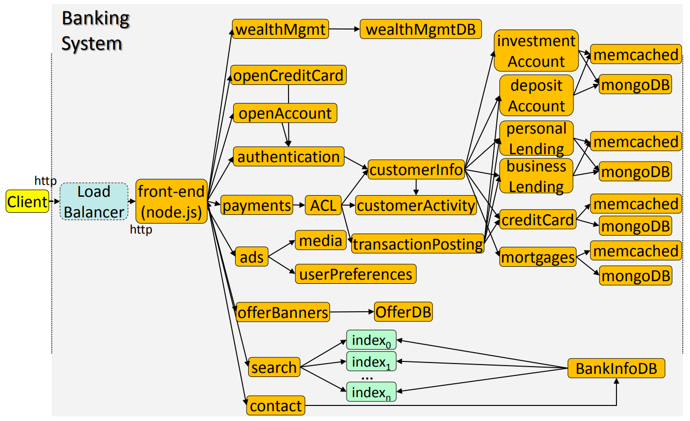

# Implementation

## Functionality:
Users interface with a **`flask` front-end**, to login to their
account, search information about the bank, or contact a
representative. Once logged in, a user can process a payment
from their account, pay their credit card or request a new one,
browse information about loans or request one, and obtain
information about wealth management options. The back-end
databases consist of **in-memory `memcached`**, and **persistent `MongoDB`** instances. The service also has a **relational database**
(BankInfoDB) that includes information about the bank, its
services, and representatives.

## Resources:

### Main
- [ ] **Load-balancer**: `HAProxy`
- [X] **Front-end**: `Flask`, `HTML`, `CSS` 
- [ ] **Wealth-management**: `MongoDB`/`NOSql`
- [ ] **Open-credit-card**: `nginx`
- [ ] **Open-account**: `nginx`
- [X] **Authentication**: 
  - [X] `MongoDB` - Auth data storage
  - [X] `Redis` - Access Token Management
- [ ] **Payments**: `Apache Server`
  - [ ] **ACL**: `LDAP`
  - [ ] **Customer-info**: `Apache-spark`
  - [ ] **Transaction-posting**: `Redis`
- [ ] **Ads**: `redis`
- [X] **Offer-banners**: `Flask`
  - [X] **OfferDB**: `Redis`
- [X] **Search**: `index-search` via `Redis + MongoDB + Flask`
- [X] **Contact**: `Flask`
- [X] **Bank-info-db**: `MongoDB`
- [ ] **Data-exchange**: `Apache-kafka`

### Support
- [X] **Tracing**: `Jaegar` using `Flask-Opentracing`